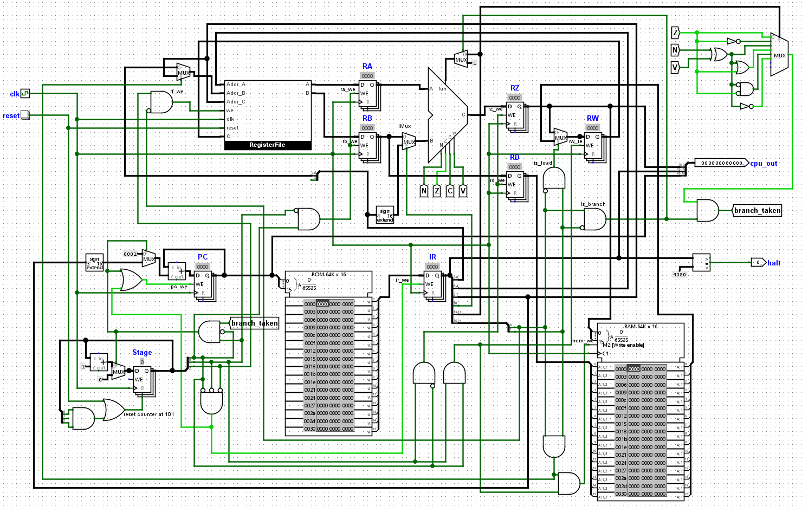
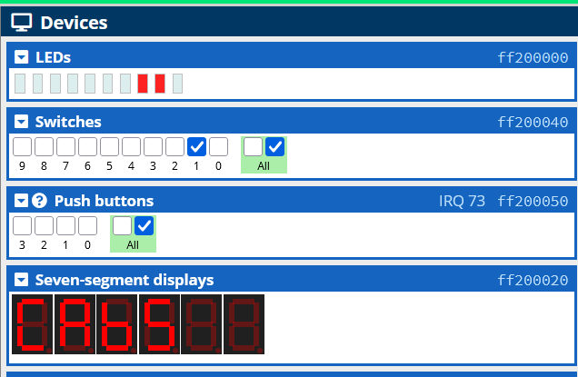
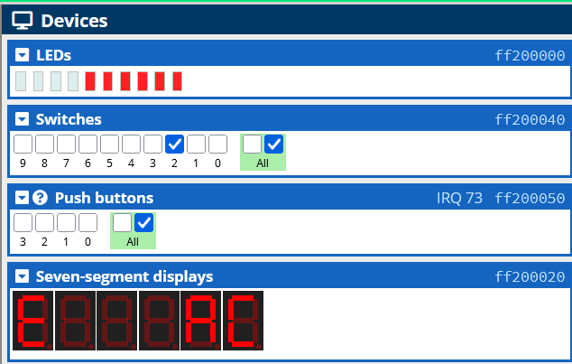
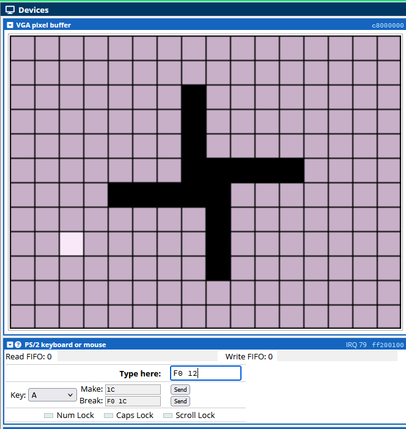

# ECSE 324 - Computer Organization

This repository contains all lab work for the course ECSE 324 - Computer Organization at McGill University, in the Winter 2026 semester.

| Lab             | Summary                                  |
|-----------------|------------------------------------------|
| [Lab 1](#lab-1) | Simple CPU using Logisim                 | 
| [Lab 2](#lab-2) | Basic assembly language programming      |
| [Lab 3](#lab-3) | Assembly programming of I/O interactions |
| [Lab 4](#lab-4) | Game of Life application                 |

## Lab 1
This lab consists of designing and implementing a basic 16-bit processor capable of executing simple programs out of a memory. The processor can handle basic logical and arithmetic operations, memory accesses and control flow operations (branching). The final design can be found [here](lab1/cpu.circ).

The processor executes each instruction in 5 stages: fetch, decode, execute, memory, writeback. I implemented the register file, ALU, datapath and control logic, and includes ROM and RAM memory.

See [Lab 1 README.md](lab1/README.md) for more information.

## Lab 2
This lab consists of an introduction to programming in ARM7 assembly, for an ARMv7 DE1-SoC board. 

In the exercise, I translated the C program [summation.c](lab2/exercise/summation.c) into an assembly program [summation.s](lab2/exercise/summation.s).

In part 1, I work with arrays and loop to implement zigzag array travresal. The assembly program [part1.s](lab2/part1/part1.s) implements this, and is based on the C program [part1.c](lab2/part1/part1.c).

In part 2, I implemented the Recaman sequence using more complex control flow, both iteratively and recusively. A recusive program in C to calculate the Recaman sequence can be found in [part2.c](lab2/part2/part2.c). Then, I wrote the recursive version in assembly in [part2-recursive.s](lab2/part2/part2-recursive.s), and the iterative version in assembly in [part2-iterative.s](lab2/part2/part2-iterative.s).  
I also performed a performance analysis (code size, instructions executed, total memory accesses) and comparison between the iterative and recursive programs, where I found that the iterative implementation outperforms the recursive one. The report can be found [here](lab2/261225197_FlavieQin_Lab2_report.pdf).

## Lab 3
This lab consists of assembly implementations of I/O interactions, on the ARMv7 DE1-SoC board.

I wrote subroutines for reading and writing I/O peripherals (device drivers), for interacting with slider switches, LEDs, 7-segment displays and pushbuttons. I also implemented drivers for the ARM A9 private timer.

In part 1, I implemented an interactive rotating HEX display program using polling in [part1.s](lab3/part1/part1.s). Characters displayed on the 7-segment displays move from one side to the other, stepping in response to pushbutton press and release, fall off the end, and wrap around the other side.  
There are 4 messages, left justified: `C0FFEE`, `CAFE5`, `CAb5`, `ACE`, which are one hot encoded (0x00, 0x01, 0x02, 0x04 respectively based on the switches), and `C0FFEE` is displayed by default. All other switch combinations results in a blank display. 
Pushbuttons rotate the sequence and modify the direction of movement:
- PB3 press and release rotates the characters one position (to the left, by default)
- PB2 press and release reverses the direction of movement (but does not make the pattern rotate)

LEDs display the number of times the sequences has been rotated, in binary, starting with 0 up to 1023. The count resets when the message changes.

In part 2, I implemented an interactive rotating HEX display program using timers and interrupts in [part2.s](lab3/part2/part2.s).  
This interactive display is similar to part 1, but the message rotates automatically, and changes direction or speed in response to pushbutton press and release.  
There are 6 messages, left justified: `C0FFEE`, `CAFE5`, `CAb5`, `ACE`, `70Ad570015`, `CAFE bEEF C0FFEE` which are one hot encoded (0x00, 0x01, 0x02, 0x04, 0x08, 0x10 respectively based on the switches). For the messages longer than 6 characters, 6 characters of the message are displayed at all time. All other switch combinations results in a blank display.  
By default, `C0FFEE` flows to the left, shifting one position and wrapping around every 0.25 seconds of simulated time (based on the A9 private timer).  
Pushbuttons modify the direction and rate of flow of characters:
- PB3 pauses and resumes character movement
- PB2 reverses direction of movement
- PB1 makes movement faster
- PB0 makes movement slower

There are 5 rates, where the message moves one position every {1/16, 1/8, 1/4, 1/2, 1} seconds. The LEDs display the currect speed of movement relative to min and max. When paused, all LEDs are off. At maximum speed, all LEDs are lit.  
The ARM A9 private timer is used to count time and interrupts are used for the pushbuttons. The switches are polled as interrupts are not supported for this peripheral.

I also producted a performance analysis for the program in part 2, to determine the amount of time spent servicing interrupts versus running user code. The report can be found [here](lab3/261225197_FlavieQin_Lab3_report.pdf).

## Lab 4
This lab consists of creating an interactive application of Conway's Game of Life, on the ARMv7 DE1-SoC board.

I wrote assembly subroutines for the VGA display (using both the pixel buffer and the character buffer) in [vga.s](lab4/vga.s) and for the PS/2 interface (to get keyboard user input) in [ps2.s](lab4/ps2.s).

Finally, I wrote a program in C to draw the game board and for the game logic in [game_of_life.c](lab4/game_of_life.c). THe VGA is used to display the field of play, and the PS/2 input is used to toggle the state of grid locations and update the game state.

Game of Life rules: 
- Any active cell with 0 or 1 active neighbours become inactive
- Any active cell with 2 or 3 active neighbours remains active
- Any active cell with 4 or more active neighbours becomes inactive
- Any inactive cell with exactly 3 active neighbours becomes active

User input: 
- `w`: move the cursor up
- `a`: move the cursor left
- `s`: move the cursor down
- `d`: move the cursor right
- `spacebar`: toggle the state of the grid location where the cursor is located
- `n`: update the state of all grid locations in the playing field

Two performance analyses were produced. One [report](lab4/reports/261225197_FlavieQin_Lab4_report_p3a.pdf) was on the game board display initialization (performance and number of data memory accesses for the VGA interface), and another [report](lab4/reports/261225197_FlavieQin_Lab4_report_p3b.pdf) was on the game state update and display sequence (computational cost of a single game state update step and how the cost is divided across interactions with I/O, game logic, etc.).
