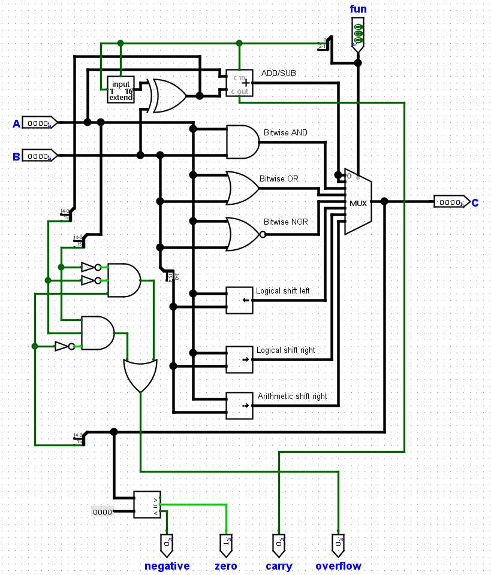
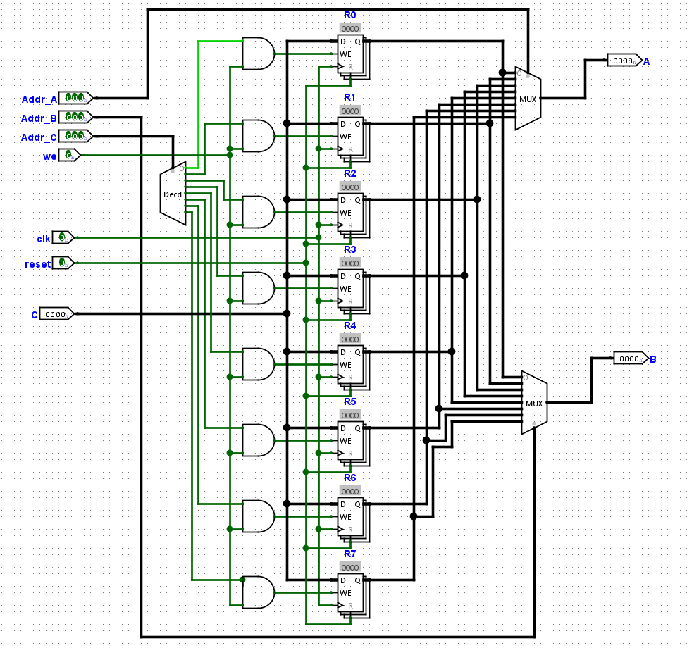

# Basic CPU

This is the design and implementation of a simple 16-bit processor, capable of executing simple instructions, using Logisim Evolution. It supports basic ALU operations, memory accesses and control flow operations.

The processor executes each instruction in five stages: fetch, decode, execute, memory and writeback. It also contains ROM and RAM components to store program instructions and program data. The CPU supports ALU operations, store, branch and load. The supported ALU operations are ADD, SUB, AND, OR, NOR, LSL, LSR, ASR and the supported branch conditions are EQ, NE, LT, LE, GT, GE. 

## Arithmetic and Logic Unit

The ALU can perform the following operations on two 16-bit inputs, A and B. The numbers are signed with the 2's complement representation. Note that for shift operations, the 4 least significant bits of B are used to specify the number of bit positions the input A is shifted.

| Function | Control lines | Description                | Output C         |
| -------- | ------------- | -------------------------- | ---------------- |
| ADD      | 0b000         | Signed integer addition    | C = A + B        |
| SUB      | 0b001         | Signed integer subtraction | C = A - B        |
| AND      | 0b010         | Bitwise AND                | C = A and B      |
| OR       | 0b011         | Bitwise OR                 | C = A or B       |
| NOR      | 0b100         | Bitwise NOR                | C = A nor B      |
| LSL      | 0b101         | Logical shift left         | C = A << B[3-0]  |
| LSR      | 0b110         | Logical shift right        | C = A >>> B[3-0] |
| ASR      | 0b111         | Arithmetic shift right     | C = A >> B[3-0]  |

It also outputs the following four flags:

- N (negative): 1 if C is negative.
- Z (zero): 1 of C is zero.
- C (carry): 1 if a carry out is generated when adding or subtracting (undefined for other operations).
- V (overflow): 1 if overflow occurs when adding or subtracting, that is two inputs of the same sign generate an output of the opposite sign (undefined for other operations).

## Register File
The register file contains 8 registers with 16 data bits each. 
Registers can be read to the outputs A and B by providing the addresses of the registers that want to be read as the inputs Addr_A and Addr_B. 0b000 corresponds to R0, 0b001 corresponds to R1, etc. 
Registers can be written to hold the value C at the next clock cycle, when the WE signal is 1. The address of the register to write to is the input Addr_C.

